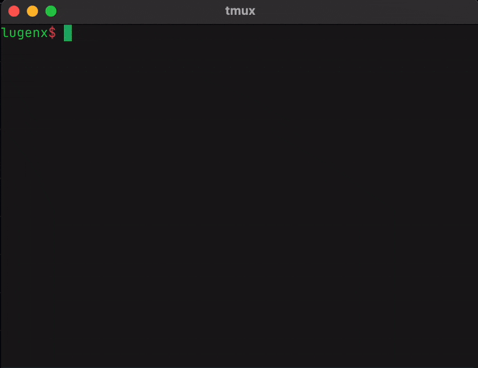

# Lab
**Lab** lets you experiment with code instantly—just type `lab js` (or any extension) and your editor opens, ready to go. No more overhead of creating files and folders. Your experiments are automatically organized with smart names (e.g., `250112a.js`) in a `lab` folder, and they clean themselves up after 7 days to keep things tidy.

## Install
### macOS (Intel)
```bash
curl -L https://github.com/lugenx/lab/releases/latest/download/lab-darwin-amd64 -o /tmp/lab && chmod +x /tmp/lab && sudo mv /tmp/lab /usr/local/bin/lab
```
### macOS (Apple Silicon)
```bash
curl -L https://github.com/lugenx/lab/releases/latest/download/lab-darwin-arm64 -o /tmp/lab && chmod +x /tmp/lab && sudo mv /tmp/lab /usr/local/bin/lab

```
### Linux
```bash
curl -L https://github.com/lugenx/lab/releases/latest/download/lab-linux-amd64 -o /tmp/lab && chmod +x /tmp/lab && sudo mv /tmp/lab /usr/local/bin/lab
```
### Windows
```powershell
curl -L -o lab-windows-amd64.exe https://github.com/lugenx/lab/releases/latest/download/lab-windows-amd64.exe
```
Move-Item .\lab-windows-amd64.exe "C:\Windows\System32\lab.exe"

## Usage
Open a new file:
```bash
lab js      # opens a new JavaScript file
lab py      # opens a new Python file
lab any     # opens a new file with any extension
```

List your files:
```bash
lab

Lab Files: ~/lab/

[1]  250112c.js     6d    # will be deleted in 6 days
[2]  250112b.py     12h   # will be deleted in 12 hours
[3]  250112a.go     45m   # will be deleted in 45 minutes
```

Open or manage files:
```bash
lab 0                  # open config file
lab 1                  # open most recent file
lab 2                  # open second file
lab -d 2, --delete 2   # delete file #2
```
Other commands:
```bash
lab -v, --version      # show version
lab -h, --help         # show help
```

## Features
- **Instant Start**: `lab <extension>` opens a fresh file.
- **Quick Access**: `lab <number>` reopens recent files.
- **Auto-Cleanup**: Files expire automatically after 7 days (configurable).
- **Smart Time Display**: Shows remaining time in days/hours/minutes with color indicators
- **Simple Listing**: Just run lab to see your files, newest first

## Configuration
Lab creates a config file at `~/lab/.lab`:
```
editor=nvim          # your preferred editor
lifedays=7          # how long to keep files
prefix=lab          # file prefix
```
You can also set `LABPATH` environment variable to change the lab directory location from the default `~/lab`.

Focus on experimenting and trying out ideas without distractions—Lab simplifies the process so you can start coding immediately.

 ## Demo
 See Lab in action:
 
